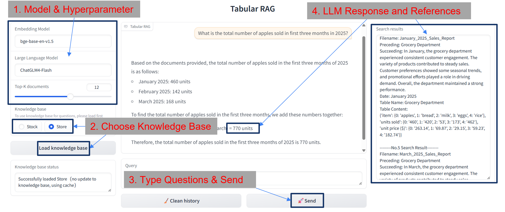

# RAG System Specialized for Tabular Documents

### Pre-run Preparation：
Install the require packages by:
```commandline
pip install -r requirements.txt
```

Place knowledge bases (folders containing similar Word documents) under ```data/inputdata```. The folder name will be used as the knowledge base name.

Place BGE model in ```src/models/baai/bge-base-en-v1.5``` or use the ```BAAI/bge-base-en-v1.5```

Create a file under the root directory named ```config.json```, and add your API keys into it. For example:
```json
{
  "ChatGLM_api_key": "xxx"
}
```

## How to use
The interface is located at ```frontends/ui.py```. After running, access http://127.0.0.1:7860. 
Operation steps are shown in the figure:



(Sending the raw table dict from search results to the chatbot can quickly convert it to readable format)

## Project Structure

### loaders：

```doc2table.py```  Split Word documents into text and tables

```pdf2doc.py```  Convert PDF to Word documents

```csv_converter.py``` Call ```doc2table``` to save split text and tables into CSV files under ```data/outputdata```

```file.py, objects.py, tags.py``` Store files/objects/tags and corresponding file I/O methods

### storages：
```faiss_search.py``` Read embedding data and perform searches

### embeddings：
```baai.py```  Load BGE, embeddings...

```csv_embedding.py``` Read extracted data from CSV, perform embedding, and save under ```data/embeddata```

### frontends:
```ui.py``` Gradio UI, switch knowledge bases, receive user input, return results

### llms:
```chatglm.py, gemini.py``` Wrap-up LLMs for easy API calls and response extraction

### utils:
```hash.py``` Hash files in folders based on filenames and modification dates

```log.py``` Logging

## Bug Fixes
AttributeError: module 'win32com.gen_py.00020905-0000-0000-C000-000000000046x0x8x7' has no attribute 'CLSIDToClassMap'

Delete```C:\Users\[Username]\AppData\Local\Temp\gen_py\3.10\00020905-0000-0000-C000-000000000046x0x8x5```